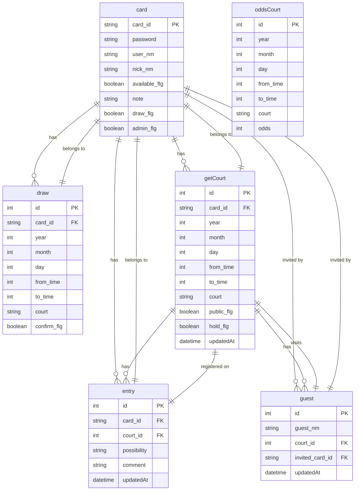

```mermaid
erDiagram
    card ||--o{ draw : "has"
    card ||--o{ getCourt : "has"
    card ||--o{ entry : "has"
    card ||--o{ guest : "invited by"
    draw ||--|| card : "belongs to"
    getCourt ||--|| card : "belongs to"
    getCourt ||--o{ entry : "has"
    getCourt ||--o{ guest : "has"
    entry ||--|| card : "belongs to"
    entry ||--|| getCourt : "registered on"
    guest ||--|| getCourt : "visits"
    guest ||--|| card : "invited by"

    card {
        string card_id PK
        string password
        string user_nm
        string nick_nm
        boolean available_flg
        string note
        boolean draw_flg
        boolean admin_flg
    }

    draw {
        int id PK
        string card_id FK
        int year
        int month
        int day
        int from_time
        int to_time
        string court
        boolean confirm_flg
    }

    getCourt {
        int id PK
        string card_id FK
        int year
        int month
        int day
        int from_time
        int to_time
        string court
        boolean public_flg
        boolean hold_flg
        datetime updatedAt
    }

    entry {
        int id PK
        string card_id FK
        int court_id FK
        string possibility
        string comment
        datetime updatedAt
    }

    guest {
        int id PK
        string guest_nm
        int court_id FK
        string invited_card_id FK
        datetime updatedAt
    }

    oddsCourt {
        int id PK
        int year
        int month
        int day
        int from_time
        int to_time
        string court
        int odds
    }
```
